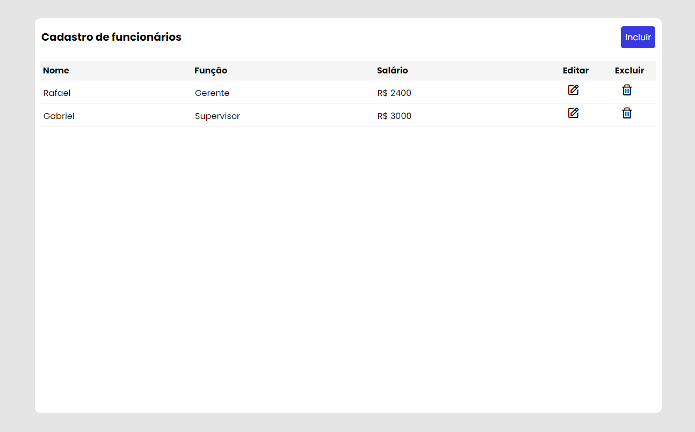
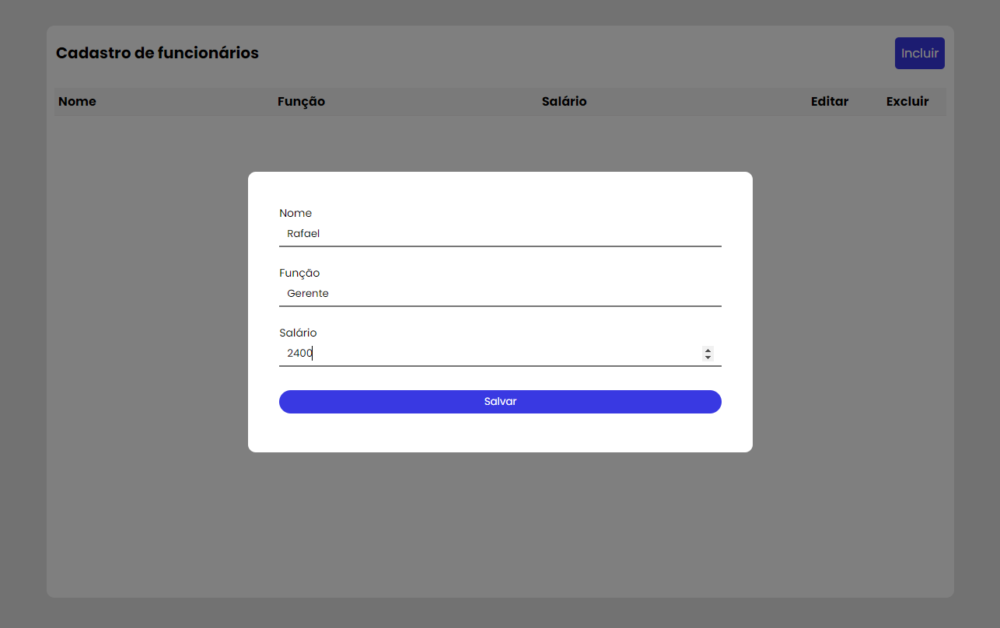

<h1 align="center"> CRUD para cadastro de funcionários </h1>

## 💻 Sobre o projeto
Projeto de CRUD para cadastro de funcionários feito com ***HTML***, ***CSS*** e ***JAVASCRIPT***, utilizando o localStorage para armazenamento de dados.

## 🎨 Imagens

  

## Autor

Feito por ***Rafael Morais***
 
👋🏽 Entre em contato!

